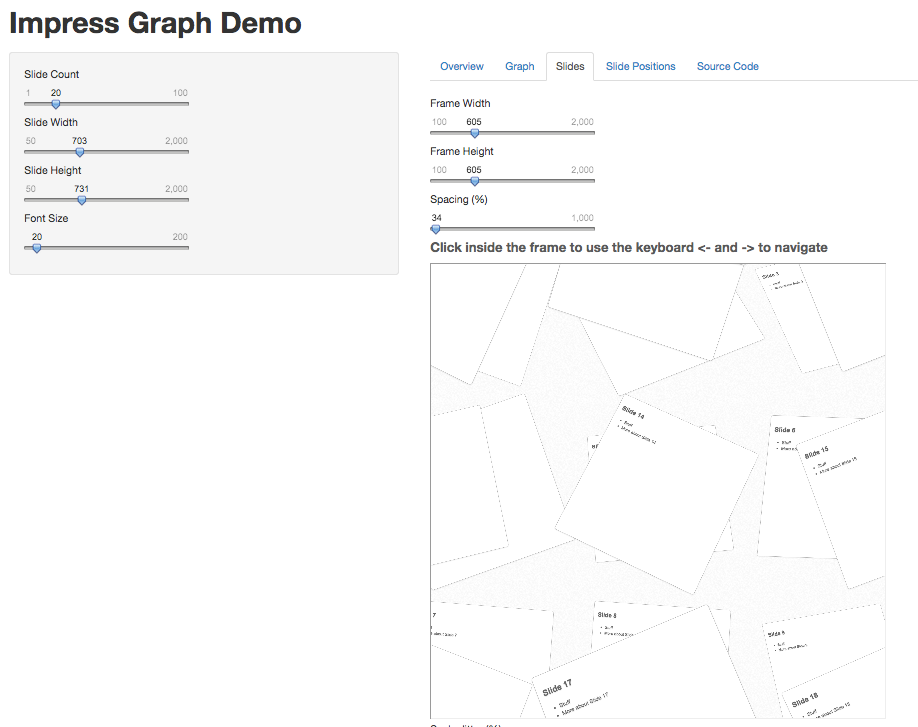
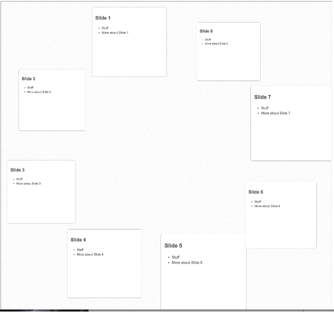

# Guide
## Using the ShinyApp
Complex graphs can be difficult to visualize and present; the idea of the tool is to make their layout and visualization easy using R, Shiny, and Jmpress. This tool uses the impress.js/jmpress.js framework to show slides arranged freely rather than the traditional stack or pile format. Rather than requiring positions for each slide to be manually entered we use the [igraph](http://www.igraph.org) toolbox in R to calculate the layout for the graph using different algorithms. The default shows a random graph with a 3D Grid layout.
To get started you setup the size and number of slides involved using the left panel.

### Graph
 The "Graph" tab can then be used to configure the "Graph Generation" and "Layout Type". The generation is how the vertices are connected together. The layout is the algorithm used to position the vertices in space (2D or 3D). The final parameter "Connectivity (%)" is for choosing in the case of Random graphs how many edges are expected.

### Slides
Shows the presentation itself in an iframe. Some browsers do not like this, in which case just use the source in the last panel.
- Standard View 



- Sphere Layout


- Circular Layout




### Slide Positions
The positions and details for the slides positioned based on the graph.

### Source
The source code for the presentation, since the iframe ```srcdoc```, makes it pretty un-readable. The formatting is not yet nice, if I find a pretty.html function somewhere, I'll use it.

## Links
The original repository is located at http://4quant.github.io/shiny-impress.js and the live demo can be found at ShinyApps.io at https://4quant.shinyapps.io/gimpress/
### Run it yourself?
Install R and the Shiny package and run

```
library(shiny)
runGitHub("4Quant/shiny-impress.js")
```

